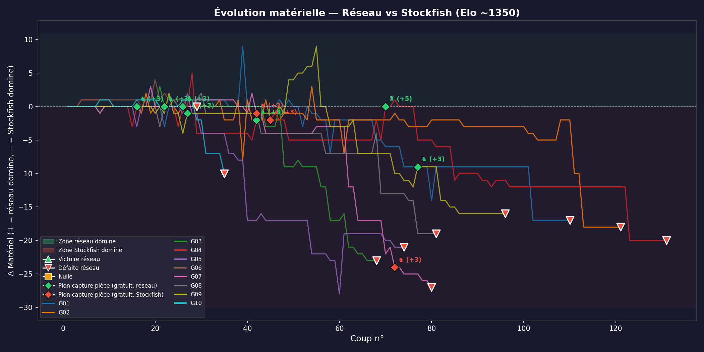

# ♟ Chess-GPU — Résultats d'entraînement et d'évaluation

> Apprendre à jouer aux échecs par imitation des Grands Maîtres, avec un réseau de neurones
> entraîné sur GPU. Ce document retrace l'intégralité de la pipeline — de la collecte des données
> à l'évaluation en partie réelle contre Stockfish — et analyse en détail les résultats obtenus
> lors du run du 15 février 2026.

---

## 1. Vue d'ensemble du projet

### Le concept : apprendre par imitation

L'approche classique pour programmer un moteur d'échecs consiste à coder manuellement des
règles d'évaluation (valeur des pièces, structure de pions, contrôle du centre, sécurité du roi)
et à les combiner avec un algorithme de recherche arborescente (minimax, alpha-beta). Cette
méthode a fait ses preuves — c'est ainsi que fonctionnent Stockfish et les moteurs traditionnels.

Notre approche est radicalement différente : **au lieu de coder des règles, on les apprend**.
On télécharge des centaines de milliers de parties jouées par les 10 meilleurs joueurs du monde
sur Chess.com, on encode chaque position de l'échiquier sous forme de vecteur numérique, et on
entraîne un réseau de neurones à prédire le prochain coup — exactement comme un Grand Maître
le jouerait. Le réseau n'a aucune connaissance préalable des échecs : il découvre les ouvertures,
les tactiques et les finales uniquement à travers les exemples.

### La pipeline complète

Le projet s'articule autour de quatre étapes séquentielles, chacune gérée par un module Python
dédié et orchestrée par un script principal (`main.py`) :

```
1. Téléchargement       2. Encodage matriciel      3. Entraînement         4. Évaluation
   (download_data.py)      (prepare_data.py)           (train_torch.py)       (evaluate.py)
                                                                                    
   Chess.com API           Position → vecteur         PyTorch + GPU           vs Stockfish
   10 joueurs GM           one-hot 832D               4 couches + BN          alpha-beta
   208 588 parties         17.7M exemples             batch=8192              Elo ~1350
   598.5 Mo PGN            256.9 Mo NPZ               2 min 48 s              10 parties
```

Le tout est automatisé dans un script unique `run_colab.py` qui détecte automatiquement si c'est
une première exécution ou une relance, et ne répète que les étapes nécessaires.

---

## 2. Données d'entraînement

### Sélection des joueurs

Nous avons sélectionné 10 Grands Maîtres parmi les meilleurs joueurs du monde, en privilégiant
ceux ayant un volume important de parties sur Chess.com. Les comptes ont été vérifiés un par un
contre l'API Chess.com (plusieurs pseudos initiaux renvoyaient des erreurs 404 et ont dû être
corrigés : `faaborovsky` → `fabianocaruana`, `duhless` → `nihalsarin`, etc.).

Le téléchargement est parallélisé avec 8 workers et récupère l'intégralité de l'historique
de chaque joueur, tous formats confondus (Bullet, Blitz, Rapid, Daily).

| # | Joueur | Elo FIDE (pic) | Compte Chess.com | Mois d'archives | Parties | Taille PGN |
|---|--------|---------------|------------------|-----------------|---------|------------|
| 1 | Magnus Carlsen | 2882 | `magnuscarlsen` | 59 | 9 092 | 27 Mo |
| 2 | Hikaru Nakamura | 2816 | `hikaru` | 146 | 67 411 | 191 Mo |
| 3 | Fabiano Caruana | 2844 | `fabianocaruana` | 96 | ~8 000 | 20 Mo |
| 4 | Ian Nepomniachtchi | 2795 | `lachesisq` | 94 | ~11 000 | 27 Mo |
| 5 | Alireza Firouzja | 2804 | `firouzja2003` | 79 | ~45 000 | 109 Mo |
| 6 | Nihal Sarin | 2694 | `nihalsarin` | 166 | ~65 000 | 160 Mo |
| 7 | Praggnanandhaa | 2747 | `rpragchess` | 104 | ~12 000 | 28 Mo |
| 8 | Maxime Vachier-Lagrave | 2819 | `lyonbeast` | 114 | ~8 000 | 19 Mo |
| 9 | Alexander Grischuk | 2810 | `grischuk` | 92 | ~7 000 | 16 Mo |
| 10 | Anish Giri | 2798 | `anishgiri` | 63 | ~2 500 | 5.5 Mo |

> **Note :** Hikaru Nakamura et Nihal Sarin dominent largement en volume car ils sont
> des streameurs très actifs sur Chess.com, jouant des dizaines de parties par jour en Bullet
> et Blitz. Cela signifie que le modèle sera biaisé vers leur style de jeu — rapide et tactique
> plutôt que positionnel.

### Volume total des données

| Métrique | Valeur |
|----------|--------|
| Fichier PGN fusionné | **598.5 Mo** |
| Parties individuelles parsées | **208 588** |
| Positions encodées (exemples d'entraînement) | **17 730 038** |
| Coups uniques dans le dictionnaire (tokens) | **1 968** |
| Fichier NPZ compressé (données encodées) | **256.9 Mo** |
| Coups moyen par partie | **~85** (170 demi-coups) |

### Encodage des positions : le vecteur one-hot 832D

Chaque position de l'échiquier est convertie en un vecteur binaire de **832 dimensions**.
L'échiquier comporte 64 cases, et chaque case peut contenir l'une de 13 catégories : vide (0),
ou l'un des 6 types de pièces (pion, cavalier, fou, tour, dame, roi) × 2 couleurs (blanc, noir).
On encode donc chaque case en one-hot sur 13 bits, ce qui donne 64 × 13 = 832 dimensions.

```
Exemple : case e1 contient un Roi blanc
  → 13 bits : [0, 0, 0, 0, 0, 0, 1, 0, 0, 0, 0, 0, 0]
                                  ↑ index 6 = Roi blanc

Position complète : concaténation des 64 cases
  → vecteur (832,) de 0 et de 1
```

Cette représentation est **simple mais limitée** : elle ne capture ni le tour de jeu
(blanc ou noir), ni les droits de roque, ni la possibilité de prise en passant, ni l'historique
des coups. Ces informations supplémentaires sont des pistes d'amélioration identifiées.

La fonction `board_to_vector()` a été optimisée pour utiliser `piece_map()` de python-chess,
qui ne retourne que les cases occupées (~20 à 32 pièces en milieu de partie), au lieu de
parcourir les 64 cases systématiquement avec `piece_at()`.

### Le dictionnaire de coups (1 968 tokens)

Tous les coups possibles aux échecs sont énumérés à l'avance dans un dictionnaire de **1 968 tokens**.
Chaque token est un triplet `(case_départ, case_arrivée, promotion)`. Ce dictionnaire couvre
tous les déplacements légaux de toutes les pièces (incluant les 4 types de promotion pour les pions).
Le réseau prédit une distribution de probabilité sur ces 1 968 tokens, puis on filtre les coups
illégaux dans la position courante.

### Optimisations du parsing

Le parsing de 208 588 parties (598.5 Mo de PGN) était initialement un goulot d'étranglement majeur.
Deux optimisations ont réduit le temps de **~80 minutes à 86 secondes** :

| Optimisation | Avant | Après | Gain |
|---|---|---|---|
| Parsing PGN parallèle (ProcessPoolExecutor, 8 workers) | ~80 min séquentiel | **86 s** parallèle | **56×** |
| `board_to_vector()` avec `piece_map()` au lieu de `piece_at()` | 64 appels/position | ~25 appels/position | **~2.5×** |

Le PGN est d'abord découpé en textes de parties individuelles (`_split_pgn`), puis distribué
en batches aux workers. Chaque worker parse ses parties indépendamment avec python-chess et
retourne les vecteurs encodés. Un point technique important : la fonction de parsing (`_parse_batch`)
a dû être définie au niveau module (et non comme fonction locale) car `ProcessPoolExecutor`
utilise `pickle` pour la communication inter-processus, et pickle ne peut pas sérialiser les
fonctions imbriquées.

---

## 3. Architecture du réseau

### ChessNet — Perceptron multi-couches à 4 couches

Le modèle est un MLP (Multi-Layer Perceptron) classique à 4 couches linéaires, avec
Batch Normalization, ReLU et Dropout entre chaque couche cachée. C'est une architecture
intentionnellement simple — l'objectif est d'établir une baseline solide avant d'explorer
des architectures plus sophistiquées (CNN, Transformer).

```
Entrée (832)  ─────────────────────────────  Position de l'échiquier (one-hot)
    │
    ├── Linear(832 → 1024)                   Première couche cachée
    ├── BatchNorm1d(1024)                    Normalisation pour stabiliser l'entraînement
    ├── ReLU                                 Activation non-linéaire
    ├── Dropout(0.3)                         Régularisation (30% des neurones désactivés)
    │
    ├── Linear(1024 → 512)                   Deuxième couche cachée
    ├── BatchNorm1d(512)
    ├── ReLU
    ├── Dropout(0.3)
    │
    ├── Linear(512 → 256)                    Troisième couche cachée
    ├── BatchNorm1d(256)
    ├── ReLU
    ├── Dropout(0.3)
    │
    └── Linear(256 → 1968)                   Couche de sortie
         └── Softmax → probabilité de chaque coup dans le dictionnaire
```

### Hyperparamètres d'entraînement

| Paramètre | Valeur | Justification |
|-----------|--------|---------------|
| Optimizer | Adam (lr=1e-3, wd=1e-5) | Convergence rapide, weight decay léger contre l'overfitting |
| Scheduler | CosineAnnealing → 1e-6 | Réduit le LR progressivement pour affiner la convergence |
| Batch size | **8 192** (auto-tuné) | Adapté automatiquement selon la VRAM disponible (512 sur T4, 8192 sur RTX 6000) |
| Epochs | 50 (patience=10) | Early stopping si la val loss ne baisse plus pendant 10 epochs |
| Dropout | 0.3 | Compromis standard entre régularisation et capacité d'apprentissage |
| Paramètres totaux | **2 018 480** (7.7 Mo) | Modèle compact : 832×1024 + 1024×512 + 512×256 + 256×1968 + biais + BN |
| Train/Val split | 90% / 10% | 15.96M exemples d'entraînement, 1.77M de validation |

### Format d'export du modèle

Le modèle entraîné est exporté dans deux formats :
- **`.pt` (PyTorch checkpoint)** : sauvegardé en premier comme filet de sécurité, contient le `state_dict` complet,
  la config, et l'historique d'entraînement. Permet de reprendre l'entraînement.
- **`.npz` (NumPy)** : format léger (7.2 Mo) utilisé par l'évaluateur. Contient les poids de chaque couche
  (`W0..W3`, `b0..b3`), les paramètres BatchNorm (`bn0_weight`, `bn0_running_mean`, etc.) et le dictionnaire
  de coups (`move_tokens`). Ce format permet l'inférence avec NumPy (CPU) ou CuPy (GPU) sans dépendre de PyTorch.

---

## 4. Entraînement

### Configuration matérielle

L'entraînement a été réalisé sur Google Colab avec le GPU suivant :

| Composant | Détail |
|-----------|--------|
| GPU | **NVIDIA RTX PRO 6000 Blackwell Server Edition** |
| VRAM totale | **95 Go** (97 887 MiB) |
| VRAM utilisée | **58 Go** (59% — dataset complet chargé sur GPU) |
| Puissance consommée | **300-365 W** sur 600 W max (50-60% du TDP) |
| Température | **44-49°C** (refroidissement serveur efficace) |
| GPU utilization | **74-85%** |
| Driver | NVIDIA 580.82.07 / CUDA 13.0 |
| Python | 3.12 |
| PyTorch | 2.0+ avec CUDA, AMP, torch.compile |

### Optimisations GPU — de 53s à 2.9s par epoch

L'entraînement initial avec les paramètres par défaut (batch_size=512, DataLoader CPU) n'utilisait
que **1.1 Go de VRAM sur 95 Go** et le GPU tournait à **0-8% d'utilisation**. Le goulot d'étranglement
était le transfert CPU→GPU : le DataLoader devait copier chaque batch de la RAM vers la VRAM à chaque
itération, et le GPU passait l'essentiel de son temps à attendre les données.

Cinq optimisations successives ont réduit le temps par epoch de **53 secondes à 2.9 secondes** (18× plus rapide) :

| # | Technique | Impact | Explication |
|---|-----------|--------|-------------|
| 1 | **Dataset complet sur VRAM** | VRAM 1→58 Go, GPU 8→78% | Les 17.7M exemples en float32 font ~55 Go — ils tiennent intégralement dans les 95 Go de VRAM. Plus aucun transfert CPU→GPU pendant l'entraînement. On itère avec `torch.randperm` et de l'indexation GPU directe au lieu d'un DataLoader. |
| 2 | **Batch size auto-tuné** | 512→8192 | Le batch_size est adapté automatiquement selon la VRAM : 8192 pour ≥40 Go, 4096 pour ≥16 Go, 2048 pour ≥8 Go. Les gros batch saturent les milliers de cores CUDA du GPU. |
| 3 | **AMP Mixed Precision (float16)** | ~2× plus rapide | Les Tensor Cores du GPU calculent beaucoup plus vite en float16 qu'en float32. Le `GradScaler` ajuste dynamiquement l'échelle des gradients pour éviter les underflows. |
| 4 | **`torch.compile`** | Fusion de kernels | PyTorch 2.0 compile le graphe de calcul en kernels CUDA optimisés, éliminant les launches de kernels individuels. |
| 5 | **`cudnn.benchmark`** | Auto-tune des convolutions | cuDNN teste plusieurs algorithmes à la première itération et sélectionne le plus rapide pour les dimensions utilisées. |

**Résultat :** 50 epochs × 2.9s = **2 min 48 s** d'entraînement total (au lieu de ~44 min avec les paramètres initiaux).

### Monitoring GPU en temps réel

Le monitoring GPU a été réalisé avec un script de monitoring continu dans une cellule Colab séparée,
interrogeant `nvidia-smi` toutes les 5 secondes. Voici un extrait typique pendant l'entraînement :

```
     Heure │ GPU % │       VRAM MiB │      Power W │  Temp
────────────────────────────────────────────────────────────
  17:52:48 │   78% │  58091/ 97887 │ 308.49/600.00 │   41°C
  17:52:53 │   78% │  58091/ 97887 │ 364.55/600.00 │   44°C
  17:53:08 │   77% │  58091/ 97887 │ 323.52/600.00 │   44°C
  17:53:18 │   77% │  58091/ 97887 │ 320.71/600.00 │   46°C
  17:54:08 │   77% │  58091/ 97887 │ 316.45/600.00 │   47°C
  17:54:53 │   77% │  58091/ 97887 │ 317.57/600.00 │   48°C
```

### Courbes d'entraînement


Le tableau ci-dessous détaille l'évolution epoch par epoch. Toutes les 50 epochs ont amélioré
la validation loss (★ à chaque epoch), ce qui signifie que le modèle n'a pas du tout overfitté
et qu'il y a encore de la marge d'amélioration avec plus d'epochs.

| Epoch | Train Loss | Val Loss | Top-1 Acc | Top-5 Acc | LR | Durée |
|-------|-----------|----------|-----------|-----------|-----|-------|
| 1 | 4.6879 | 3.8459 | 18.3% | 40.5% | 1.0e-03 | 6.7s ★ |
| 2 | 4.2600 | 3.6837 | 19.7% | 43.0% | 1.0e-03 | 2.9s ★ |
| 3 | 4.1419 | 3.5967 | 20.4% | 44.3% | 1.0e-03 | 2.9s ★ |
| 5 | 4.0104 | 3.4933 | 21.2% | 45.9% | 9.8e-04 | 2.9s ★ |
| 10 | 3.8581 | 3.3715 | 22.3% | 48.1% | 9.2e-04 | 2.9s ★ |
| 15 | 3.7901 | 3.3091 | 23.0% | 49.3% | 8.2e-04 | 2.9s ★ |
| 20 | 3.7472 | 3.2693 | 23.4% | 50.0% | 6.8e-04 | 2.9s ★ |
| 25 | 3.7135 | 3.2391 | 23.7% | 50.7% | 5.3e-04 | 2.9s ★ |
| 30 | 3.6837 | 3.2121 | 24.1% | 51.3% | 3.8e-04 | 2.8s ★ |
| 35 | 3.6566 | 3.1882 | 24.4% | 51.8% | 2.3e-04 | 2.8s ★ |
| 40 | 3.6329 | 3.1704 | 24.6% | 52.2% | 1.2e-04 | 2.8s ★ |
| 45 | 3.6180 | 3.1593 | 24.7% | 52.4% | 3.6e-05 | 2.9s ★ |
| **50** | **3.6117** | **3.1548** | **24.8%** | **52.5%** | 2.0e-06 | 2.8s ★ |

**Durée totale d'entraînement : 2 min 48 s**

### Interprétation des métriques

**Top-1 accuracy = 24.8%** signifie que le réseau joue exactement le même coup qu'un Grand Maître
dans 24.8% des positions. Avec 1 968 coups possibles dans le dictionnaire, le hasard donnerait
~0.05%, donc le réseau est **496× meilleur que le hasard**. Cela dit, se tromper 3 fois sur 4
est insuffisant pour jouer correctement aux échecs, car une seule erreur tactique peut coûter la partie.

**Top-5 accuracy = 52.5%** signifie que le coup du GM figure parmi les 5 meilleurs prédictions
du réseau une fois sur deux. C'est encourageant car cela montre que le réseau a bien capté les
grandes tendances stratégiques — il propose généralement des coups raisonnables, même s'il ne
trouve pas toujours le meilleur.

**Pas d'overfitting :** la train loss (3.61) reste supérieure à la val loss (3.15) sur les
50 epochs, avec un écart stable (~0.46). Cela indique que le modèle a encore de la capacité
d'apprentissage et bénéficierait de plus d'epochs ou d'un réseau plus large. Le early stopping
(patience=10) n'a jamais été déclenché.

**Convergence du cosine annealing :** le learning rate passe de 1e-3 à 2e-6 sur 50 epochs.
Les gains sont rapides au début (18.3% → 22.3% en 10 epochs) puis ralentissent progressivement
(22.3% → 24.8% sur les 40 epochs restantes). Un redémarrage du cosine annealing sur 100-200 epochs
supplémentaires pourrait débloquer 2-3% de top-1 en plus.

---

## 5. Évaluation vs Stockfish

### Protocole d'évaluation

Le modèle est évalué en jouant des parties complètes contre **Stockfish 14**, limité à un Elo
de **~1350** (niveau club amateur intermédiaire). Chaque évaluation comprend 10 parties, le modèle
alternant entre les Blancs et les Noirs. Stockfish dispose de 0.1 seconde par coup.

L'évaluation est réalisée avec le backend **CuPy** (GPU) pour l'inférence du réseau, et
**8 threads parallèles** pour jouer plusieurs parties simultanément. Un lock GPU sérialise les
appels CuPy (qui n'est pas thread-safe).

### Modes d'évaluation

| Mode | Description | Paramètres |
|------|-------------|------------|
| **Instantané** | Le réseau joue directement le coup ayant la plus haute probabilité parmi les coups légaux. Pas de recherche, pas d'anticipation. | `--games 10` |
| **Recherche α-β** | Recherche alpha-beta avec iterative deepening. Le réseau génère les candidats (top-k par probabilité), la recherche explore l'arbre de jeu. Un budget global de nœuds limite la durée. | `--games 10 --max-depth 4 --max-nodes 1000` |
| **Benchmark** | Joue les mêmes 10 parties dans les deux modes et compare les résultats côte à côte. | `--games 10 --benchmark --max-depth 4 --max-nodes 1000` |

### Résultats détaillés

#### Mode instantané (15 février 2026, 17:55:26)

| Partie | Couleur | Résultat | Demi-coups | Observation |
|--------|---------|----------|------------|-------------|
| G01 | ⬜ Blancs | ❌ Défaite | ~212 | Longue fin de partie, le réseau joue sans but |
| G02 | ⬛ Noirs | ❌ Défaite | ~187 | Stockfish obtient 2 dames (Δ+18), mat inévitable |
| G03 | ⬜ Blancs | ❌ Défaite | ~302 | Partie très longue, le réseau ne conclut jamais |
| G04 | ⬛ Noirs | ❌ Défaite | ~71 | Écrasé rapidement, matériel Δ+20 pour Stockfish |
| G05 | ⬜ Blancs | ❌ Défaite | ~167 | Perd du matériel progressivement |
| G06 | ⬛ Noirs | ❌ Défaite | ~23 | Mat en 15 coups — tactique ratée |
| G07 | ⬜ Blancs | ❌ Défaite | ~247 | Le réseau survit longtemps mais sans plan |
| G08 | ⬛ Noirs | ❌ Défaite | ~51 | Défaite rapide |
| G09 | ⬜ Blancs | ❌ Défaite | ~137 | Matériel Δ-16 en fin de partie |
| G10 | ⬛ Noirs | 🤝 Nulle | ~150 | Seule nulle — position simplifiée |

**Score : 0W - 1D - 9L = 0.5/10 (5%) — Elo estimé : ~838**

#### Mode recherche α-β (15 février 2026, 17:55:37)

| Partie | Couleur | Résultat | Demi-coups | Nœuds typiques/coup | Observation |
|--------|---------|----------|------------|---------------------|-------------|
| G01 | ⬜ Blancs | 🤝 Nulle | ~200 | 60-145 | Matériel égal (3v3), 200 coups sans conclusion |
| G02 | ⬛ Noirs | ❌ Défaite | ~88 | 26-51 | Mat forcé par Stockfish |
| G03 | ⬜ Blancs | ❌ Défaite | ~186 | 86 | Perd en milieu de partie |
| G04 | ⬛ Noirs | ❌ Défaite | ~49 | 35-51 | Défaite rapide |
| G05 | ⬜ Blancs | ❌ Défaite | ~138 | 31 | Sacrifice incorrect par la recherche |
| G06 | ⬛ Noirs | ❌ Défaite | ~54 | 71 | Perd du matériel tôt |
| G07 | ⬜ Blancs | ❌ Défaite | ~238 | 160 | Longue partie, pas de plan |
| G08 | ⬛ Noirs | ❌ Défaite | ~43 | 35 | Mat rapide |
| G09 | ⬜ Blancs | ❌ Défaite | ~134 | 29 | Recherche peu profonde |
| G10 | ⬛ Noirs | ❌ Défaite | ~50 | 125 | Perd en milieu de partie |

**Score : 0W - 0D - 10L = 0.0/10 (0%) — Elo estimé : ~950**

#### Benchmark comparatif

| Métrique | Instantané | Recherche d=4 n=1000 |
|----------|-----------|---------------------|
| Victoires | 0 | 0 |
| Nulles | 1 | 0 |
| Défaites | 9 | 10 |
| Win rate | 5% | 0% |
| Elo estimé | ~838 | ~950 |
| Durée moyenne/partie | **155 demi-coups** | **109 demi-coups** |
| Score interne typique | `+0.0` (constant) | oscillant (`-1.9` à `+8.3`) |

### Graphiques de matériel

Les graphiques ci-dessous montrent l'évolution du matériel (en points : pion=1, cavalier/fou=3,
tour=5, dame=9) au cours de chaque partie. La ligne bleue représente l'avantage matériel du
point de vue du réseau.

**Mode instantané :**



**Mode recherche :**


### Analyse approfondie des parties

#### Symptôme n°1 : le réseau perd du matériel sans le savoir

Dans la partie G09 (mode instantané), le réseau joue les Blancs et se retrouve avec un déficit
matériel de Δ-16 (1 point de matériel blanc contre 17 points noirs — Stockfish a récupéré
quasiment toutes les pièces). Malgré cette situation catastrophique, le score interne du réseau
reste `sc=+0.0` à chaque coup. Le réseau continue de jouer "normalement", déplaçant son roi
sans aucune conscience que la partie est perdue.

```
G09 │  43.f2g3   🤖 │ mat ⬜ 2 ⬛17 Δ-15 │ legal= 35 │ d= 0 n=1 sc=+0.0
G09 │  44.g3f4   🤖 │ mat ⬜ 1 ⬛17 Δ-16 │ legal= 42 │ d= 0 n=1 sc=+0.0
G09 │  45.f4e4   🤖 │ mat ⬜ 1 ⬛17 Δ-16 │ legal= 37 │ d= 0 n=1 sc=+0.0
```

**Explication :** le réseau ne prédit que le prochain coup probable, pas la qualité de la position.
Il n'a aucune notion de "gagner" ou "perdre" — il joue comme s'il récitait des coups appris par cœur.

#### Symptôme n°2 : avantage matériel non converti

Dans la partie G04 (mode instantané), le réseau joue les Noirs et se retrouve paradoxalement
avec **+12 points de matériel d'avance** (il a beaucoup plus de pièces que Stockfish). Mais il
est incapable de convertir cet avantage en mat. Il promène ses pièces sans plan pendant 66 coups
jusqu'à ce que Stockfish, malgré son handicap matériel, trouve un mat tactique.

**Explication :** savoir quel coup un GM jouerait ≠ comprendre pourquoi il le joue. Le réseau
imite des patterns de coups sans comprendre les objectifs stratégiques sous-jacents (centraliser,
couper le roi adverse, coordonner les pièces pour le mat).

#### Symptôme n°3 : la recherche alpha-beta n'aide pas

Contre-intuitivement, le mode recherche (Elo ~950) fait **moins bien** que le mode instantané
(Elo ~838) en termes de nulles (0 vs 1). La recherche rend les parties plus courtes (109 vs 155
demi-coups) car elle "s'engage" avec plus de confiance dans des lignes qu'elle estime favorables —
mais son évaluation est erronée.

L'évaluation alpha-beta combine le score matériel et la mobilité avec un bonus de probabilité
issu du réseau. Mais le réseau attribue des probabilités élevées à des coups "typiques de GM"
qui ne sont pas forcément bons dans la position donnée. La recherche amplifie ces biais au lieu
de les corriger.

Le score interne oscille de façon erratique : `-1.9` → `+8.3` → `-1.5` sur des coups successifs
dans la même partie (G01). Cela montre que la fonction d'évaluation n'est pas cohérente et ne
peut pas guider efficacement un arbre de recherche.

### Pourquoi la recherche n'aide pas (encore)

La recherche alpha-beta est un multiplicateur de force — elle amplifie la qualité de la fonction
d'évaluation. Si l'évaluation est bonne (comme dans Stockfish), la recherche est extrêmement
puissante. Si l'évaluation est incohérente (comme notre réseau), la recherche amplifie les erreurs.

Pour que la recherche devienne utile, il faudrait :
1. **Une tête d'évaluation** : entraîner le réseau à prédire non seulement le prochain coup
   mais aussi le résultat de la partie (victoire/nulle/défaite). Cela donnerait un vrai score
   positionnel pour guider la recherche.
2. **Une meilleure précision top-1** : avec 24.8%, le réseau se trompe 3 fois sur 4. Au-dessus
   de ~35%, les erreurs deviennent rares et la recherche peut les compenser.

---

## 6. Fichiers de sortie

### Structure des résultats

Chaque exécution de l'évaluation produit un ensemble complet de fichiers horodatés dans un
sous-dossier dédié. L'horodatage garantit que les résultats ne sont jamais écrasés, permettant
de comparer les performances entre différentes versions du modèle.

```
chess-gpu/
├── src/
│   ├── common/                              # code partagé entre phases
│   │   ├── download_data.py                 # téléchargement PGN Chess.com
│   │   └── prepare_data.py                  # PGN → vecteurs .npz
│   ├── phase1_mlp/                          # réseau feedforward (cette phase)
│   │   ├── main.py                          # orchestrateur pipeline
│   │   ├── train_torch.py                   # entraînement PyTorch (GPU)
│   │   ├── train.py                         # ancien modèle linéaire (archive)
│   │   └── evaluate.py                      # évaluation vs Stockfish
│   └── phase2_transformer/                  # futur — architecture Transformer
│
├── results/
│   └── phase1_mlp/
│       ├── results.md                       # ce document
│       ├── training_curves.png              # courbes loss/accuracy
│       ├── instant_material.png             # graphique matériel (mode instantané)
│       ├── instant_summary.json             # résumé JSON (mode instantané)
│       ├── instant_games.html               # visualisation interactive
│       ├── search_d4_material.png           # graphique matériel (recherche d=4)
│       ├── search_d4_summary.json           # résumé JSON (recherche d=4)
│       └── search_d4_games.html             # visualisation interactive
│
├── docs/
│   ├── king_matrix.md                       # théorie matricielle du roi
│   └── model.md                             # théorie du modèle linéaire
│
├── data/                                    # données (gitignored)
│   ├── top_players.pgn                      # 598.5 Mo — parties brutes
│   ├── top_players.npz                      # 256.9 Mo — données encodées
│   ├── top_players_model.npz                # 7.2 Mo  — poids du réseau
│   └── top_players_model_checkpoint.pt      # 7.8 Mo  — checkpoint PyTorch
│
├── run_colab.py                             # script tout-en-un Colab
├── requirements.txt
└── README.md
```

### Format du JSON de résumé

```json
{
  "model": "data/top_players_model.npz",
  "mode": "instantané",
  "max_depth": 0,
  "max_nodes": 0,
  "stockfish_elo": 1350,
  "estimated_elo": 950,
  "n_games": 10,
  "wins": 0,
  "draws": 0,
  "losses": 10,
  "score": 0.0,
  "win_rate": 0.0,
  "workers": 8,
  "tag": "20260215_175526_instantané"
}
```

### Format du log (extrait)

Chaque ligne du log contient : le numéro de partie, le coup joué, l'identité du joueur
(🤖 réseau ou ♟ Stockfish), le matériel de chaque camp, la profondeur de recherche atteinte,
le nombre de nœuds explorés et le score évalué.

```
G04 │  55...f3e4   🤖 │ mat ⬜12 ⬛ 0 Δ+12 │ legal= 26 │ d=0 n=1 fw=1 sc=+0.0 t=0.00s
G04 │  56.c2c4    ♟ │ mat ⬜12 ⬛ 0 Δ+12 │ legal=  5 │                     stockfish
```

---

## 7. Performance de la pipeline

### Temps d'exécution détaillé

| Étape | Durée | Détail |
|-------|-------|--------|
| Installation Stockfish | ~5 s | `apt install -y stockfish` |
| Clone du repo + dépendances | ~15 s | `git clone` + `pip install -r requirements.txt` |
| Téléchargement PGN | **~15 min** | 10 joueurs × 8 workers parallèles, 598.5 Mo total |
| Lecture et découpage du PGN | **0.9 s** | `_split_pgn()` : lecture séquentielle du fichier 598 Mo |
| Parsing et encodage | **86 s** | 208k parties → 17.7M exemples, 8 workers ProcessPoolExecutor |
| Sauvegarde NPZ | ~5 s | Compression de 17.7M × 832 uint8 → 256.9 Mo |
| Chargement sur GPU | ~10 s | Transfert de 27.5 Go (float32) du CPU vers la VRAM |
| Entraînement | **2 min 48 s** | 50 epochs × 2.9s, batch=8192, AMP, torch.compile |
| Export modèle | ~1 s | Checkpoint .pt (7.8 Mo) + export .npz (7.2 Mo) |
| Évaluation instantanée | **~10 s** | 10 parties en parallèle (8 workers) |
| Évaluation recherche | **~20 s** | 10 parties, depth=4, 1000 nœuds/coup |
| Benchmark | **~30 s** | 2×10 parties (instantané + recherche) |
| **Total (première exécution)** | **~20 min** | Avec téléchargement des données |
| **Total (relance)** | **~3 min** | Entraînement + évaluations seulement |

### Répartition du temps (première exécution)

```
Téléchargement   ████████████████████████████████████████  75%  (~15 min)
Parsing          █████                                      6%  (86 s)
Entraînement     ███████                                    9%  (2 min 48 s)
Évaluations      ███                                        5%  (~60 s)
Divers           ██                                         5%  (~60 s)
```

Le téléchargement depuis Chess.com domine largement. En relance (données déjà téléchargées),
l'entraînement prend 90% du temps.

---

## 8. Stack technique

| Composant | Technologie | Rôle |
|-----------|-------------|------|
| Langage | Python 3.12 | Orchestration et logique métier |
| Deep Learning | PyTorch 2.0+ | Entraînement du réseau (CUDA, AMP, torch.compile) |
| Inférence GPU | CuPy | Inférence NumPy-compatible sur GPU pendant l'évaluation |
| Échecs | python-chess | Représentation du plateau, validation des coups, parsing PGN |
| Adversaire | Stockfish 14 | Moteur d'évaluation limité à Elo 1350 |
| Calcul matriciel | NumPy | Encodage des positions, export du modèle |
| Parallélisme | ProcessPoolExecutor, ThreadPoolExecutor | Parsing PGN (multiprocess) et parties d'évaluation (multithreaded) |
| Environnement | Google Colab | GPU cloud (RTX PRO 6000 Blackwell, 95 Go VRAM) |
| Versioning | Git + GitHub | Code source et résultats |
| Automatisation | `run_colab.py` | Script tout-en-un adaptatif pour Colab |

### Dépendances Python

```
torch>=2.0
chess
numpy
matplotlib
```

---

## 9. Pistes d'amélioration

### Gains rapides (faible effort, impact modéré)

| Piste | Impact attendu | Explication |
|-------|---------------|-------------|
| **Plus d'epochs (100-200)** | Top-1 ~26-28% | La val loss baissait encore à epoch 50, le modèle n'a pas convergé. Un cosine restart sur 200 epochs devrait donner 2-3% de plus. |
| **Réseau plus large** (2048→1024→512→256) | Top-1 ~27-30% | Le modèle actuel (2M params) est petit. Doubler la première couche ajoute ~1.7M params et exploite mieux les 17.7M exemples. |
| **Augmenter les parties de jeu** | Meilleure généralisation | Télécharger 50 joueurs au lieu de 10 pour diversifier les styles et atteindre 500k+ parties. |

### Gains structurels (effort moyen, impact fort)

| Piste | Impact attendu | Explication |
|-------|---------------|-------------|
| **Encoder les métadonnées** | +1-2% top-1 | Ajouter au vecteur d'entrée : le tour de jeu (1 bit), les droits de roque (4 bits), la case d'en-passant (6 bits). Passe de 832D à ~845D. |
| **Tête d'évaluation** | Score fiable pour α-β | Ajouter une sortie auxiliaire au réseau prédisant le résultat de la partie (Win/Draw/Loss). L'entraîner avec les résultats des parties (disponibles dans le PGN). Cela donnerait un vrai score positionnel pour la recherche alpha-beta. |
| **CNN sur l'échiquier 8×8** | Capture les patterns spatiaux | Représenter l'échiquier comme une image 8×8×13 et utiliser des convolutions. Les CNN capturent naturellement les structures spatiales (colonnes ouvertes, diagonales, structures de pions). |

### Gains majeurs (effort élevé, impact transformateur)

| Piste | Impact attendu | Explication |
|-------|---------------|-------------|
| **Architecture Transformer** | State-of-the-art | L'attention multi-tête permet de capturer les relations à longue distance entre les pièces (menaces, défenses, coordination). C'est l'approche d'AlphaZero/Leela Chess Zero. |
| **Self-play + MCTS** | Elo +200-400 | Entraîner le réseau à jouer contre lui-même avec Monte Carlo Tree Search (comme AlphaZero). Le réseau s'améliore de façon autonome, sans données humaines. |
| **Réseau d'évaluation dédié** | Recherche efficace | Séparer le réseau de prédiction de coups (policy head) et le réseau d'évaluation (value head) comme dans AlphaZero. |

---

## 10. Conclusion

### Ce qui fonctionne

Ce projet démontre qu'il est possible de construire un joueur d'échecs fonctionnel **en partant
de zéro**, sans aucune connaissance codée en dur, avec seulement **3 minutes de calcul GPU**
et **17.7 millions de positions** de Grands Maîtres. Le réseau atteint **24.8% de précision top-1**
(496× mieux que le hasard) et **52.5% de top-5** — il joue des coups raisonnables dans la majorité
des positions.

La pipeline est rapide et reproductible : téléchargement parallèle (~15 min), parsing optimisé
(86s), entraînement sur GPU (2 min 48 s). Le tout est automatisé dans un script unique pour
Google Colab.

### Ce qui ne fonctionne pas encore

Le réseau ne bat pas Stockfish, même bridé à 1350 Elo. Les causes sont identifiées :

1. **Pas de conscience positionnelle** — le réseau prédit des coups sans comprendre leur but
   stratégique. Il peut avoir un avantage matériel écrasant et ne pas savoir le convertir.
2. **La recherche alpha-beta est contreproductive** — sans fonction d'évaluation fiable, elle
   amplifie les erreurs du réseau au lieu de les compenser.
3. **L'encodage est incomplet** — le vecteur 832D ne contient ni le tour de jeu, ni les droits
   de roque, ni l'en-passant, ce qui prive le réseau d'informations cruciales.

### Le goulot d'étranglement

Le goulot d'étranglement n'est plus le calcul. Grâce aux optimisations GPU (dataset en VRAM, AMP,
batch=8192), l'entraînement ne prend que 3 minutes pour 50 epochs. Le vrai défi est la
**représentation** : un MLP plat avec un encodage one-hot ne peut pas capturer les structures
spatiales et les relations stratégiques complexes des échecs.

Les prochaines étapes — tête d'évaluation positionnelle, encodage enrichi, et architecture
spatiale (CNN ou Transformer) — devraient permettre de franchir la barre des **1000 Elo**
et de rendre la recherche alpha-beta enfin utile.

---

## Annexe : Commandes Colab

### Exécution complète

```bash
cd /content && python chess-gpu/run_colab.py
```

### Copier les résultats dans le repo pour les versionner

```bash
mkdir -p /content/chess-gpu/results/phase1_mlp
cp /content/chess-gpu/data/top_players_model_curves.png /content/chess-gpu/results/phase1_mlp/training_curves.png
cp /content/chess-gpu/data/top_players_model_runs/*instantané*_material.png /content/chess-gpu/results/phase1_mlp/instant_material.png
cp /content/chess-gpu/data/top_players_model_runs/*instantané*_summary.json /content/chess-gpu/results/phase1_mlp/instant_summary.json
cp /content/chess-gpu/data/top_players_model_runs/*instantané*_games.html /content/chess-gpu/results/phase1_mlp/instant_games.html
cp /content/chess-gpu/data/top_players_model_runs/*recherche*_material.png /content/chess-gpu/results/phase1_mlp/search_d4_material.png
cp /content/chess-gpu/data/top_players_model_runs/*recherche*_summary.json /content/chess-gpu/results/phase1_mlp/search_d4_summary.json
cp /content/chess-gpu/data/top_players_model_runs/*recherche*_games.html /content/chess-gpu/results/phase1_mlp/search_d4_games.html
cd /content/chess-gpu && git add results/ && git commit -m "docs: add phase1 results" && git push
```

### Monitoring GPU

```python
import subprocess, time, datetime
print(f"{'Heure':>10} │ {'GPU %':>5} │ {'VRAM MiB':>14} │ {'Power W':>12} │ {'Temp':>5}")
print("─" * 60)
try:
    while True:
        out = subprocess.check_output(
            ["nvidia-smi", "--query-gpu=utilization.gpu,memory.used,memory.total,power.draw,power.limit,temperature.gpu",
             "--format=csv,noheader,nounits"], text=True).strip()
        gpu, mem, mem_t, pwr, pwr_m, temp = [x.strip() for x in out.split(",")]
        ts = datetime.datetime.now().strftime("%H:%M:%S")
        print(f"{ts:>10} │ {gpu:>4}% │ {mem:>6}/{mem_t:>6} │ {pwr:>5}/{pwr_m:>5} │ {temp:>4}°C")
        time.sleep(5)
except KeyboardInterrupt:
    print("\n⏹ Monitoring arrêté")
```

---

*Projet : [chess-gpu](https://github.com/knoel99/chess-gpu) — Run du 15 février 2026 sur NVIDIA RTX PRO 6000 Blackwell (95 Go VRAM)*
